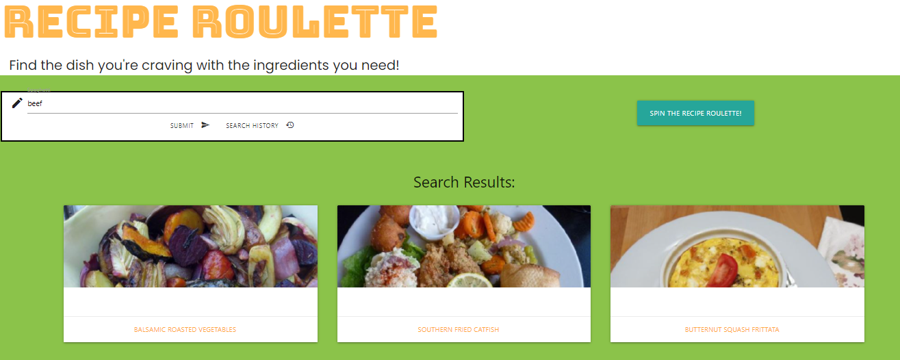

# recipe-roulette

Purpose: To allow users to make a recipe of what they want or a random recipe.  

Deployed url:https://cristina-gorrino.github.io/recipe-roulette/

## Description

Users can type in what kind of food they would like to prepare then click on the submit button. 
Then three recipe choices will appear of what kinda food the user typed in. Then if the user likes the recipe choices. 
Then they would choose one recipe and it will send them to the recipe page and give them instructions on how to prepare the dish. 
If the user did not like the recipe choices. Then the user would take a chance at spin the recipe roulette button. 
The user will then have three different options of recipes.  Choose one of the three recipes and it will send them to 
the recipe page and give them instructions on how to prepare the dish. Also the user has the search history option 
of the last three searchs they did.

## Visuals

Below are some examples of the Recipe-Roulette app

